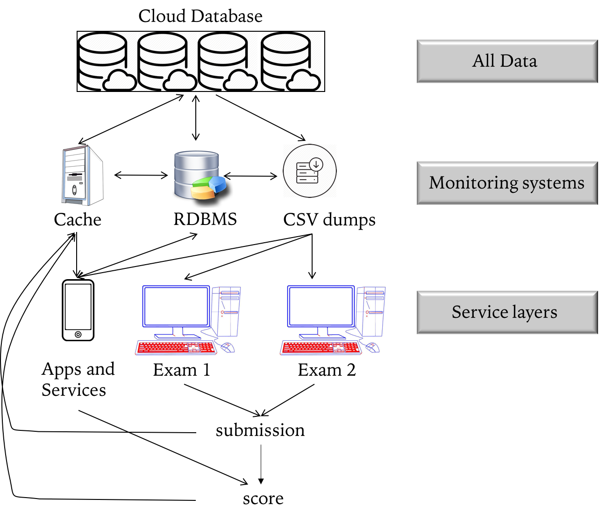
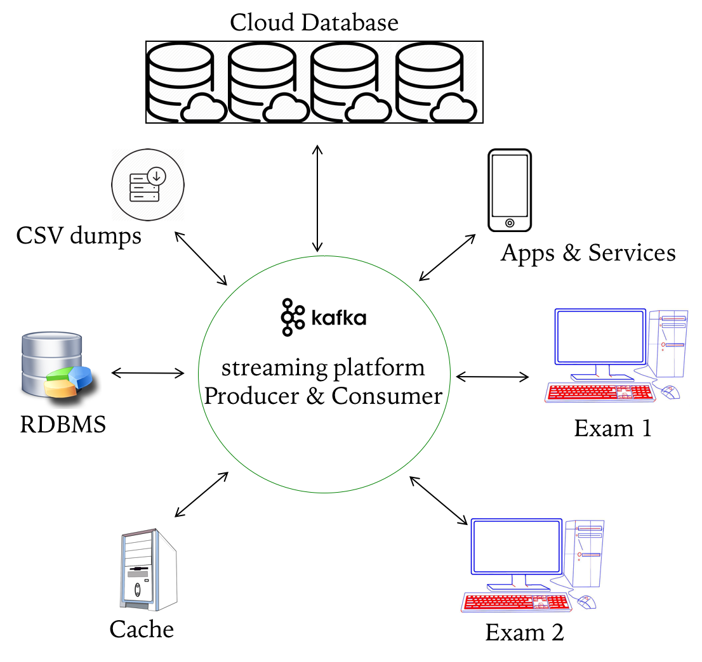

```{r setup, include=FALSE}
library(knitr)
knitr::opts_chunk$set(fig.pos = 'h', out.extra='', echo = FALSE)
```

# Kenneth Annotation, Assignment 7 (2018 July 2) 

__Synopsis__  

As a data scientist at Ed Tech Firm that specializes in administering a number of tests, a common issue that comes up often to our data scientist team was a latency issue among several of our data warehouse. We have lots of data systems: relational databases, Apache Hadoop, Apache Spark, Redis, service system, a search system and monitoring systems. The raw data, repositories of past and present tests and results, are currently housed in AWS S3. A number of exam questions are dumped into a service layer before the actual test. The real-time data that are accumulated as exam takers submit their answers are stored in monitoring systems. As a result, our team spent most of our time establishing multiple pipelines connecting several of our data warehouse to streamline our data. However, the latency issue with different APIs across different pipelines still persists. Another confounding factor ensues as we expand our test centers, geographical replications of all of our pipelines have become another daily struggles for our team to streamline our data. A typical flowchart of our data is shown below.  

{width=50%}

__Kafka__  

To overcome the latency issue and real time impact, our team deployed kafka messaging system (open-source) in our test centers. Kafka serves as a central warehouse from which several service centers retrieve (consume) or immediately feed (produce) their real-time data for instant implementation. The goal of our data scientist team is to facilitate test takers exams schedules, adjust their exam questions based on their real-time answers and instant scoring system. Kafka facilitates all of our needs in our data warehouse and provides an efficiency and timeliness.  

{width=50%}


### 1. Logging into the assignment folder
  cd w205/assignment-06-kckenneth/

### 2. Checking what's in my directory
  ls

### 3. Making sure at which branch I am on git
  git branch

### 4. Checking if there's any pre-existing docker-compose running
  docker-compose ps  
  docker ps -a  

##### if need be, remove any running containers by rm
  docker rm container id

### 5. Run docker container 
  docker run -it --rm -v /home/science/w205:/w205 midsw205/base:latest bash

## Inside Docker Container
1. check into assignment 6 folder,
2. check git branch, 
3. download json file, 
4. create docker-compose.yml

  cd assignment-06-kckenneth  
  ls  
  git status  
  git branch  
  curl -L -o assessment-attempts-20180128-121051-nested.json https://goo.gl/f5bRm4  
  vi docker-compose.yml  
  exit  

## In Droplet, I spin up the cluster in detached mode by -d
  docker-compose up -d

### Check if the zookeeper is up and running by finding the *binding* word in the logs file
  docker-compose logs zookeeper | grep -i binding  

### I also checked kafka is up and running by searching the word *started*
  docker-compose logs kafka | grep -i started

## I. Kafka 1st step -- Create a Topic
#### I created a topic *exams* with partition 1, replication-factor 1
  docker-compose exec kafka kafka-topics --create --topic exams --partitions 1 --replication-factor 1 --if-not-exists --zookeeper zookeeper:32181

#### I checked the broker I just created by *describe* function  
  docker-compose exec kafka kafka-topics --describe --topic exams --zookeeper zookeeper:32181
  
## II. Kafka 2nd step -- Produce Messages 
#### Since we have added midsw205 image in our cluster, we can directly pipe our json file query (mids image) into kafka producer (kafka image)[Cluster magic]
  docker-compose exec mids bash -c "cat /w205/assignment-06-kckenneth/assessment-attempts-20180128-121051-nested.json | jq '.[]' -c | kafkacat -P -b kafka:29092 -t exams && echo 'Produced 100 messages.'"

## III. Kafka 3rd step -- Consume Messages
  docker-compose exec kafka kafka-console-consumer --bootstrap-server kafka:29092 --topic exams --from-beginning --max-messages 42

#### Count the number of messages
  docker-compose exec mids bash -c "kafkacat -C -b kafka:29092 -t exams -o beginning -e" | wc -l

### Tear down the cluster
  docker-compose down  
  docker-compose ps     # Check if it's complete shutdown  
  docker ps -a          # Check if there's any container left  

# Caution  

- If you run the kafka producer again with the json file, the messages will add up to the previous messages, adding up the total messages produced.  
- Messages can be consumed multiple times until they are removed from the system. 

# Next Step  
- I checked the json file, it has 114 key words, including:   
  - keen_timestamp  
  - max_attempts  
  - started_at  
  - base_exam_id  

- It looks like there are 4 questions type: each with a multiple choice: True or False. Based on the students' answers submission, kafka can facilitate scoring students submission by producing and consuming the data in real time. 
- This is reflective of what is going on in computer-adjusted examinations such as GRE, GMAT where questions appearing in next attempt are adjusted based on students performance on current questions. 
- We could also look at the duration of time each student takes for the exam.   
- There are 3181 entry in our database.  

