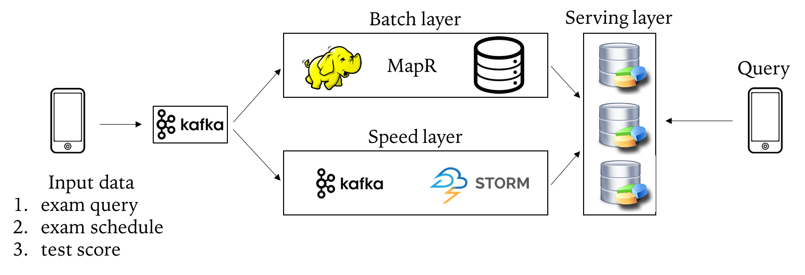

|Title |  Kafka deployment in Educational Firm |
|-----------|----------------------------------|
|Author | Kenneth Chen, Ph.D |
|Utility | Kafka, Spark, HDFS, Droplet, Docker, LA |
|Date | 6/29/2018 |

__Synopsis__  

   As a data scientist at Ed Tech Firm that specializes in administering a number of tests, a common issue that comes up often to our data scientist team was a latency issue among several of our data warehouses. We have lots of database systems: relational databases, Apache Hadoop, Apache Spark, Redis, service system, a search system and monitoring systems. The raw data, repositories of past and present tests and results, are currently housed in AWS S3. A number of exam questions are dumped into a service layer before the actual test. The real-time data that are accumulated as exam takers submit their answers are stored in monitoring systems. As a result, our team spent most of our time establishing multiple pipelines connecting several of our data warehouses to streamline our data. However, the latency issue with different APIs across different pipelines still persists. Another confounding factor ensues as we expand our test centers, geographical replications of all of our pipelines have become another daily struggles for our team to streamline our data. A typical flowchart of our data is shown in Figure 1.  

<p align="center">
</p>
<p align="center">Figure 1. Data Communications</p>

__Kafka__  

To overcome the latency issue and impact on real time data analytics, our team deployed kafka messaging system (open-source) in our test centers. Kafka serves as a central warehouse from which several service centers retrieve (consume) or immediately feed (produce) their real-time data for instant implementation. The goal of our data scientist team is to facilitate test takers exams schedules, adjust their exam questions based on their real-time answers and instant scoring system. Kafka facilitates all of our needs in our data warehouse and provides an efficiency and timeliness (Figure 2).  

<p align="center">
</p>
<p align="center">Figure 2. Kafka Real Time Data Communications</p>

__Lambda Architecture__  

By implementing a real time data analytics by kafka, our team establish more efficient and powerful database management system, known as **Lambda Architecture (LA)** coined by Nathan Marz. Deploying two parallel warehouses; batch layer and speed layer, we are now able to tackle big data as well as provide real time answers to our potential students and test takers (Figure 3).  

<p align="center">
</p>
<p align="center">Figure 3. Lambda Architecture</p>

__Procedure__  

We first deployed several docker containers: each equipped with essential libraries for necessary applications such as kafka containers for kafka applications and midsw205/spark-python container for spark applications. By doing so eliminates conventional cumbersome heavy weight instantiation of virual machine (VM) with unnecessary libraries and applications. In order to successfully load our containers, we listed them in docker-compose.yml file. Once all containers are up and running, we double-checked each container logs file to make sure they have already started running. 

In next step, we launched Kafka and created a topic. Data from json file was released in Kafka producer mode. We then piped our Kafka topic into spark and analyzed the data. All data engineered in spark was later stored in HDFS. 

I laid out a step by step implementation of Kafka in details in the following.  

## In Droplet, Update images 
### 1. Updating Docker Images 
```
docker pull midsw205/base:latest   
docker pull confluentinc/cp-zookeeper:latest  
docker pull confluentinc/cp-kafka:latest  
docker pull midsw205/spark-python:0.0.5  
```
### 2. Logging into the assignment folder
```
cd w205/assignment-07-kckenneth/
```
### 3. Checking what's in my directory 
```
ls  
```

### 4. Making sure at which branch I am on git
```
git branch   
```
### 5. Checking if there's any pre-existing docker containers running
```
docker-compose ps  
docker ps -a  
```
   ##### if need be, remove any running containers by rm
```
docker rm -f $(docker ps -aq) 
```
### 6. Run a single docker container midsw205 in bash mode
```
docker run -it --rm -v /home/science/w205:/w205 midsw205/base:latest bash
```
## Inside the Docker Container
1. check into assignment 7 folder,
2. check git branch, create assignment branch if necessary  
3. download json file,  
4. create docker-compose.yml  

```
cd assignment-07-kckenneth  
ls  
git status  
git branch 
git checkout -b assignment  
curl -L -o assessment-attempts-20180128-121051-nested.json https://goo.gl/f5bRm4  
vi docker-compose.yml  
exit  
```
## In Droplet, I spin up the cluster in detached mode by -d
```
docker-compose up -d
```
### Check if the zookeeper is up and running by finding the *binding* word in the logs file
```
docker-compose logs zookeeper | grep -i binding  
```
### I also checked kafka is up and running by searching the word *started*
```
docker-compose logs kafka | grep -i started
```
## I. Kafka 1st step -- Create a Topic
#### I created a topic *exams* with partition 1, replication-factor 1
```
docker-compose exec kafka kafka-topics --create --topic exams --partitions 1 --replication-factor 1 --if-not-exists --zookeeper zookeeper:32181
```
#### I checked the broker I just created by *describe* function  
```
docker-compose exec kafka kafka-topics --describe --topic exams --zookeeper zookeeper:32181
```  
## II. Kafka 2nd step -- Produce Messages 
#### Since we have added midsw205 image in our cluster, we can directly pipe our json file query (mids image) into kafka producer (kafka image)[Cluster magic]
```
docker-compose exec mids bash -c "cat /w205/assignment-07-kckenneth/assessment-attempts-20180128-121051-nested.json | jq '.[]' -c | kafkacat -P -b kafka:29092 -t exams && echo 'Produced EXAM messages.'"
```
## III. Kafka 3rd step -- Consume Messages
- (1) We can consume Kafka messages independently as follows:  
```
docker-compose exec kafka kafka-console-consumer --bootstrap-server kafka:29092 --topic exams --from-beginning --max-messages 42
```
- (2) With Apache Spark container, we can directly pipe our Kafka messages into Spark and analyze the data in Spark  
```
docker-compose exec spark pyspark  
```  
## In Spark Environment  
1. I first assigned the Kafka messages as "messages" object.  
2. I counted the number of messages which counted at 3280 entries.  
3. I also checked the first 20 rows. 
4. Printing the format shows that Kafka messages in "binary" format. 
5. I transformed them into strings format.  

```
>>> messages = spark.read.format("kafka").option("kafka.bootstrap.servers", "kafka:29092").option("subscribe","exams").option("startingOffsets", "earliest").option("endingOffsets", "latest").load()  
>>> messages.count()  
>>> messages.show()   
>>> messages.printSchema()   
>>> messages_as_strings = messages.selectExpr("CAST(key AS STRING)", "CAST(value AS STRING)")  
```
### For sanity check, I double checked the transformed messages object.  
```
>>> messages_as_strings.count()  
>>> messages_as_strings.show()  
>>> messages_as_strings.printSchema()  
```
# Message Dissection and Analytics  

## I. Single Thread Processing 

#### Since there are 3280 entries, I checked the first message. In order to feed the string object into dictionary format, I imported the json library. 

```
>>> import json  
```
#### Load the first messages of the entire Kafka messages into 'first_message' object  

```
>>> first_message = json.loads(messages_as_strings.select('value').take(1)[0].value)  
```
#### As I'm interested in the exam type, total number of questions for each exam and students performance, I checked the message as follows:  
1. Check the first level keys  
2. Check the 2nd, 3rd level keys   
3. Print those respective keys values  

```
>>> print(first_message.keys())  

dict_keys(['keen_timestamp', 'max_attempts', 'started_at', 'base_exam_id', 'user_exam_id', 'sequences', 'keen_created_at', 'certification', 'keen_id', 'exam_name'])  

>>> print(first_message['sequences'].keys())  

dict_keys(['questions', 'attempt', 'id', 'counts'])  

>>> print(first_message['sequences']['counts'])  

dict_keys(['incomplete', 'submitted', 'incorrect', 'all_correct', 'correct', 'total', 'unanswered'])  
```

## II. Parallel Threads Processing 

One advantages of Spark is to process the table in parallel threads so that we can quickly observe the result and check the data. In order to do so, I first created a dataframe which will be saved in HDFS in parquet format. Parquet format allows data unchangeable so we won't lose any data from trimming and formatting. I then transformed the dataframe into temporary SQL table named "exams" so that I can easily query the data with SQL in spark. I also saved files as I modified into **HDFS /tmp/** folder. 

#### 1. Cache the raw messages to avoid annoying messages popping up
```
>>> messages.cache()
```

#### 2. Convert the messages binary into string format(only use the dictionary 'value')
```
>>> messages_string = messages.select(messages.value.cast('string'))
```

#### 3. Transform the messages_string into dataframe (df) lambda function and save df.  

```
>>> import json
>>> messages_df = messages_string.rdd.map(lambda x: json.loads(x.value)).toDF()
>>> messages_df.printSchema()

root
 |-- base_exam_id: string (nullable = true)
 |-- certification: string (nullable = true)
 |-- exam_name: string (nullable = true)
 |-- keen_created_at: string (nullable = true)
 |-- keen_id: string (nullable = true)
 |-- keen_timestamp: string (nullable = true)
 |-- max_attempts: string (nullable = true)
 |-- sequences: map (nullable = true)
 |    |-- key: string
 |    |-- value: array (valueContainsNull = true)
 |    |    |-- element: map (containsNull = true)
 |    |    |    |-- key: string
 |    |    |    |-- value: boolean (valueContainsNull = true)
 |-- started_at: string (nullable = true)
 |-- user_exam_id: string (nullable = true)
```  
This schema turns out to be 'null' for nexted keys which have 'string' type and integer type. So transforming the raw data into a dataframe as shown below gave me the right schema.  

```
>>> messages_df = spark.read.json(messages_string.rdd.map(lambda x: x.value))
>>> messages_df.printSchmea()

root
 |-- base_exam_id: string (nullable = true)
 |-- certification: string (nullable = true)
 |-- exam_name: string (nullable = true)
 |-- keen_created_at: string (nullable = true)
 |-- keen_id: string (nullable = true)
 |-- keen_timestamp: string (nullable = true)
 |-- max_attempts: string (nullable = true)
 |-- sequences: struct (nullable = true)
 |    |-- attempt: long (nullable = true)
 |    |-- counts: struct (nullable = true)
 |    |    |-- all_correct: boolean (nullable = true)
 |    |    |-- correct: long (nullable = true)
 |    |    |-- incomplete: long (nullable = true)
 |    |    |-- incorrect: long (nullable = true)
 |    |    |-- submitted: long (nullable = true)
 |    |    |-- total: long (nullable = true)
 |    |    |-- unanswered: long (nullable = true)
 |    |-- id: string (nullable = true)
 |    |-- questions: array (nullable = true)
 |    |    |-- element: struct (containsNull = true)
 |    |    |    |-- id: string (nullable = true)
 |    |    |    |-- options: array (nullable = true)
 |    |    |    |    |-- element: struct (containsNull = true)
 |    |    |    |    |    |-- at: string (nullable = true)
 |    |    |    |    |    |-- checked: boolean (nullable = true)
 |    |    |    |    |    |-- correct: boolean (nullable = true)
 |    |    |    |    |    |-- id: string (nullable = true)
 |    |    |    |    |    |-- submitted: long (nullable = true)
 |    |    |    |-- user_correct: boolean (nullable = true)
 |    |    |    |-- user_incomplete: boolean (nullable = true)
 |    |    |    |-- user_result: string (nullable = true)
 |    |    |    |-- user_submitted: boolean (nullable = true)
 |-- started_at: string (nullable = true)
 |-- user_exam_id: string (nullable = true)
```

Encoding any ouput in utf-8 and saving in HDFS in parquet format  
```
>>> import sys
>>> sys.stdout = open(sys.stdout.fileno(), mode='w', encoding='utf8', buffering=1)
>>> messages_df.write.parquet('/tmp/messages_df')  
```

**Note**  
Lambda function is different from Lambda Architecture (LA) mentioned above.  
When you write in parquet, make sure you slash before tmp, i.e., ('/tmp/'), not ('tmp/)  

Check the hadoop file system in the tmp folder in another CLI window  
```
$ docker-compose exec cloudera hadoop fs -ls /tmp/

drwxrwxrwt   - mapred mapred              0 2018-02-06 18:27 /tmp/hadoop-yarn
drwx-wx-wx   - root   supergroup          0 2018-07-07 15:17 /tmp/hive
drwxr-xr-x   - root   supergroup          0 2018-07-07 19:02 /tmp/messages_df
```
##### Storing and Retrieving parquet file from Hadoop (Optional)

This is just to illustrate how to store data and read back in parquet format in HDFS.  
```
>>> df.write.parquet('/tmp/myfile')
>>> my_file = sqlContext.read.parquet('/tmp/myfile')
```

#### 4. Creating a 'exams' Table in order to query  
```
>>> messages_df.registerTempTable('exams')
```

# Data Analytics
Here I explored data more thoroughly with SQL command.  First I checked the keys in the dataframe.  

I looked at the exam name and the total number of exams taken from the dataset. 

```
>>> spark.sql("SELECT exam_name FROM exams LIMIT 10").show()
+--------------------+
|           exam_name|
+--------------------+
|Normal Forms and ...|
|Normal Forms and ...|
|The Principles of...|
|The Principles of...|
|Introduction to B...|
|        Learning Git|
|Git Fundamentals ...|
|Introduction to P...|
|Intermediate Pyth...|
|Introduction to P...|
+--------------------+

>>> spark.sql("SELECT COUNT(exam_name) FROM exams").show()

+----------------+
|count(exam_name)|
+----------------+
|            3280|
+----------------+
```
Sanity check, we did not lose any data, which is 3280 entries in our dataset. 

```
>>> spark.sql("SELECT COUNT(DISTINCT exams.exam_name) FROM exams").show()

+-------------------------+                                                     
|count(DISTINCT exam_name)|
+-------------------------+
|                      103|
+-------------------------+
```
There are **103** unique exams and we have 3280 entries. So I further checked which exams or courses are frequently taken by students.  

```
>>> spark.sql("SELECT exam_name, COUNT(exam_name) as exam_count FROM exams GROUP BY exam_name ORDER BY exam_count DESC").show() 

+--------------------+----------+                                               
|           exam_name|exam_count|
+--------------------+----------+
|        Learning Git|       394|
|Introduction to P...|       162|
|Intermediate Pyth...|       158|
|Introduction to J...|       158|
|Learning to Progr...|       128|
|Introduction to M...|       119|
|Software Architec...|       109|
|Beginning C# Prog...|        95|
|    Learning Eclipse|        85|
|Learning Apache M...|        80|
+--------------------+----------+

spark.sql("SELECT exam_name, COUNT(exam_name) as exam_count FROM exams GROUP BY exam_name ORDER BY exam_count ASC LIMIT 10").show()  

+--------------------+----------+                                               
|           exam_name|exam_count|
+--------------------+----------+
|Nulls, Three-valu...|         1|
|Learning to Visua...|         1|
|Native Web Apps f...|         1|
|Operating Red Hat...|         1|
|Client-Side Data ...|         2|
|Arduino Prototypi...|         2|
|What's New in Jav...|         2|
|Understanding the...|         2|
|Hibernate and JPA...|         2|
|Learning Spring P...|         2|
+--------------------+----------+
```

Interestingly, **Learning Git**, **Introduction to Python** exams were taken mostly and **Learning to Visualization**, **Native Web Apps** exams were taken once each. To further explore the nature of the exam, I created a table called "exams_table" to have the most insightful information from the dataset.  

```
>>> exams_table = spark.sql("SELECT user_exam_id, exam_name, sequences.counts.all_correct, sequences.counts.correct, sequences.counts.incomplete, sequences.counts.incorrect, sequences.counts.submitted, sequences.counts.total, sequences.counts.unanswered FROM exams")
>>> exams_table.show()

+--------------------+--------------------+-----------+-------+----------+---------+---------+-----+----------+
|        user_exam_id|           exam_name|all_correct|correct|incomplete|incorrect|submitted|total|unanswered|
+--------------------+--------------------+-----------+-------+----------+---------+---------+-----+----------+
|6d4089e4-bde5-4a2...|Normal Forms and ...|      false|      2|         1|        1|        4|    4|         0|
|2fec1534-b41f-441...|Normal Forms and ...|      false|      1|         2|        1|        4|    4|         0|
|8edbc8a8-4d26-429...|The Principles of...|      false|      3|         0|        1|        4|    4|         0|
|c0ee680e-8892-4e6...|The Principles of...|      false|      2|         2|        0|        4|    4|         0|
|e4525b79-7904-405...|Introduction to B...|      false|      3|         0|        1|        4|    4|         0|
|3186dafa-7acf-47e...|        Learning Git|       true|      5|         0|        0|        5|    5|         0|
|48d88326-36a3-4cb...|Git Fundamentals ...|       true|      1|         0|        0|        1|    1|         0|
|bb152d6b-cada-41e...|Introduction to P...|       true|      5|         0|        0|        5|    5|         0|
|70073d6f-ced5-4d0...|Intermediate Pyth...|       true|      4|         0|        0|        4|    4|         0|
|9eb6d4d6-fd1f-4f3...|Introduction to P...|      false|      0|         1|        0|        1|    5|         4|
+--------------------+--------------------+-----------+-------+----------+---------+---------+-----+----------+
```

Saving the tables in HDFS. I also create a temporary SQL table in order to query  
```
>>> exams_table.write.parquet('/tmp/exams_table')
>>> exam_tables.registerTempTable("exams_tables")
```

I created two tables in order to count the number of exam takers who answered all questions correctly, labled as **All_True**, and the rest of the students who happened to have one false answer, labeled as **Not_All_True**. I then joined two tables to display both counts in each row with an additional column created "Proficiency" obtained by dividing the number of all_true students by the total number of students based on the exams. 

```
>>> all_true = spark.sql("SELECT exam_name, COUNT(all_correct) as All_True FROM exams_table WHERE all_correct = 'true' GROUP BY exam_name ORDER BY All_True DESC")
>>> all_true.registerTempTable("all_true")

>>> not_all_true = spark.sql("SELECT exam_name, COUNT(all_correct) as Not_All_True FROM exams_table WHERE all_correct = 'false' GROUP BY exam_name ORDER BY Not_All_True DESC")
>>> not_all_true.registerTempTable("not_all_true")

# Full Outer Join Two Tables  
>>> spark.sql("SELECT t1.exam_name, t1.All_True, t2.Not_All_True, ROUND(t1.All_True/(t1.All_True+t2.Not_All_True), 2) as Proficiency FROM all_true as t1 FULL OUTER JOIN not_all_true as t2 ON t1.exam_name=t2.exam_name ORDER BY Proficiency DESC").show()

+--------------------+--------+------------+-----------+                        
|           exam_name|All_True|Not_All_True|Proficiency|
+--------------------+--------+------------+-----------+
|Learning SQL for ...|      10|           1|       0.91|
|Git Fundamentals ...|      21|           7|       0.75|
|Introduction to H...|       6|           2|       0.75|
|Introduction to A...|       4|           2|       0.67|
|Introduction to J...|      94|          64|       0.59|
|Introduction to A...|       4|           3|       0.57|
|Refactor a Monoli...|       9|           8|       0.53|
|What's New in Jav...|       1|           1|        0.5|
|Learning Apache C...|       6|           6|        0.5|
|Introduction to A...|       4|           5|       0.44|
+--------------------+--------+------------+-----------+ 

>>> spark.sql("SELECT t1.exam_name, t1.All_True, t2.Not_All_True, ROUND(t1.All_True/(t1.All_True+t2.Not_All_True), 2) as Proficiency FROM all_true as t1 FULL OUTER JOIN not_all_true as t2 ON t1.exam_name=t2.exam_name ORDER BY t1.All_True DESC").show()

+--------------------+--------+------------+-----------+                        
|           exam_name|All_True|Not_All_True|Proficiency|
+--------------------+--------+------------+-----------+
|        Learning Git|     130|         264|       0.33|
|Introduction to J...|      94|          64|       0.59|
|Introduction to M...|      46|          73|       0.39|
|Beginning Program...|      29|          50|       0.37|
|Advanced Machine ...|      24|          43|       0.36|
|Intermediate Pyth...|      23|         135|       0.15|
|Git Fundamentals ...|      21|           7|       0.75|
|    Learning Eclipse|      21|          64|       0.25|
|Learning Apache M...|      21|          59|       0.26|
|Learning to Progr...|      20|         108|       0.16|
+--------------------+--------+------------+-----------+ 
```
This analysis shows us that 91% of students who take **Learning SQL** can answer all exam questions correctly. It is also interesting to note that **Introduction to Java** exam was taken 94 + 64 = 158 times and proficiency of students was at **59%**. Based on our previous findings that **Learning Git** exam was frequently taken, we checked the proficiency of students. We found that only **33%** of the students who took Learning Git can answer questions correctly. 

# Storing and Retrieving parquet file from Hadoop (Optional)

This is just to illustrate how to store data and read back in parquet format in HDFS.  
```
>>> df.write.parquet('/tmp/myfile')
>>> my_file = sqlContext.read.parquet('/tmp/myfile')
```
#### Exit Spark
```
>>> exit()  
```
## Tear down the cluster
```
docker-compose down    
docker-compose ps        
docker ps -a            
```
#### Exit Droplet
```
exit 
```

# Caution  

- If you run the kafka producer again with the json file, the messages will add up to the previous messages, adding up the total messages produced.  
- Messages can be consumed multiple times until they are removed from the system. 

# Summary

There are 3280 exam entries from our firm. Exams were of different types and there are **103** unique exams available for students to take. Out of 3280 exam entries, **Learning Git** exam was taken **394** times followed by **Introduction to Python** and **Intermediate Python** exams that accounted for **162** and **158** respectively. The exams that were taken the least were **Nulls, Three Value**, **Learning to Visualization**, **Learning Native Web Apps** and **Operating Red Hat**. They all accounted for 1 exams each out of 3280 entries. 

This analysis shows us that **91%** of students who take **Learning SQL** can answer all exam questions correctly. It is also interesting to note that **Introduction to Java** exam was taken 94 + 64 = 158 times and proficiency of students was at **59%**. Based on our previous findings that **Learning Git** exam was frequently taken, we checked the proficiency of students. We found that only **33%** of the students who took Learning Git can answer questions correctly. 

There are only **9** exams out of 103 exams that proficiency of students stood more than **50%**. They are - 

|           exam_name|All_True|Not_All_True|Proficiency|
|--------------------|--------|------------|-----------|
|Learning SQL for ...|      10|           1|       0.91|
|Git Fundamentals ...|      21|           7|       0.75|
|Introduction to H...|       6|           2|       0.75|
|Introduction to A...|       4|           2|       0.67|
|Introduction to J...|      94|          64|       0.59|
|Introduction to A...|       4|           3|       0.57|
|Refactor a Monoli...|       9|           8|       0.53|
|What's New in Jav...|       1|           1|        0.5|
|Learning Apache C...|       6|           6|        0.5|

- There are at least 4 questions for each exam type: each question with a multiple choice: True or False. Based on the students' answers submission, kafka can facilitate scoring students submission by producing and consuming the data in real time. 
- This is reflective of what is going on in computer-adjusted examinations such as GRE, GMAT where questions appearing in next attempt are adjusted based on students performance on current questions. 
- Our observations indicates that SQL is easy to learn and students can answer majority of the quesions correctly. Interestingly students can also achieve 75% in **Git Fundamentals**. However, majority of students cannot answer all questions correctly in **Learing Git** exam.   
